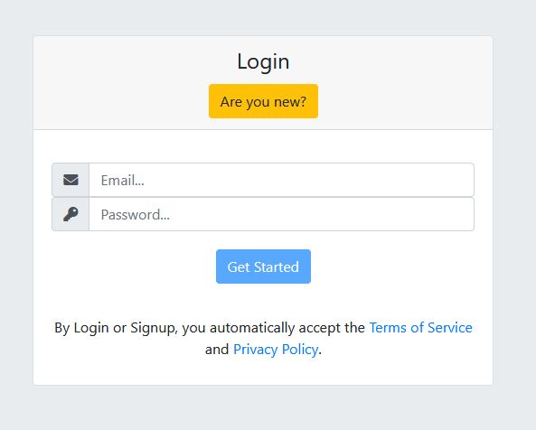

Hello. 

This will be a short and quick tutorial on reactive forms with Angular.
We'll be learning step by step on how to create a single 
signup/login/reset form with a couple of extra dynamic elements.



The idea and assumption are that generally, these three forms have common elements,
we can combine them and save time and long-term maintainability without sacrificing much UI/UX. 

Let's start.

### References 

- [Angular Reactive Forms](https://angular.io/guide/reactive-forms)
- [Complete code](https://stackblitz.com/edit/angular-reactive-forms-multi)

### Step 1: Basic setup

Head over to your `app.module.ts` or any parent module.
Make sure it has the following imports and structure.

```ts
import { NgModule } from '@angular/core';
import { BrowserModule } from '@angular/platform-browser';
import { ReactiveFormsModule } from '@angular/forms';

import { AppComponent } from './app.component';

@NgModule({
  imports: [
    BrowserModule,
    ReactiveFormsModule
  ],
  declarations: [
    AppComponent
  ],
  bootstrap: [AppComponent]
})

export class AppModule { }
```


### Step 2: Form UI/UX

Below is the code for the whole dynamic form.
It reacts to user input and changes accordingly. 
It also includes validation and error feedback.

```html
<div class="jumbotron">
  <div class="container">
    <div class="row">
      <div class="col-lg-4 col-md-6 ml-auto mr-auto">
        <div class="card">
          <form class="form" [formGroup]="formGroup" (ngSubmit)="process()">

            <div class="card-header card-header-primary text-center">
              <h4 class="card-title">
                {{newUser ? 'Signup' : 'Login'}}
              </h4>
              <a (click)="toggle()" class="btn btn-warning">
                {{newUser ? 'Already have an account?' : 'Are you new?'}}
              </a>
            </div>

            <div class="card-body">
              <p class="description text-center">

                <div class="input-group" *ngIf="newUser">
                  <div class="input-group-prepend">
                    <span class="input-group-text">
                      <i class="fa fa-user-circle"></i>
                    </span>
                  </div>
                  <input type="text" name="name" formControlName="name" class="form-control" placeholder="Name...">
                </div>

                <div class="input-group">
                  <div class="input-group-prepend">
                    <span class="input-group-text">
                      <i class="fa fa-envelope"></i>
                    </span>
                  </div>
                  <input type="email" name="email" formControlName="email" required class="form-control"
                    placeholder="Email...">
                </div>
                <p *ngIf="formErrors.email" class="text-center text-danger">
                  {{formErrors.email}}
                </p>

                <div class="input-group">
                  <div class="input-group-prepend">
                    <span class="input-group-text">
                      <i class="fa fa-key"></i>
                    </span>
                  </div>
                  <input type="password" name="password" formControlName="password" required class="form-control"
                    placeholder="Password...">
                </div>
                <p *ngIf="formErrors.password" class="text-center text-danger">
                  {{formErrors.password}}
                </p>

              </div>

              <div class="footer text-center">            
                <button type="submit" [disabled]="!formGroup.valid" class="btn btn-primary btn-wd">Get Started</button>

                <br>
                <br>

                <a *ngIf="!passReset && formGroup.controls.email.valid" class="btn btn-danger btn-link"
                  (click)="forgotPassword()">
                  Reset my password
                </a>

                <p *ngIf="passReset" class="text-primary">
                  Reset requested. Check your email for instructions.
                </p>

                <p style="padding: 12px;">
                  By Login or Signup, you automatically accept the <a href="#">Terms of Service</a> and <a href="#">Privacy Policy</a>.
                </p>
              </div>
          </form>
        </div>
      </div>
    </div>
  </div>
</div>
```

Ok, so what's going on?

The form will be bound with `formGroup` variable in `.component.ts` 
using `[formGroup]` directive.

The submit event will be bound to `process` function as well, where we'll 
be able to handle form states and react accordingly.


### Step 3: Form Logic

```ts
import { Component, OnInit } from '@angular/core';
import { FormBuilder, FormGroup, Validators } from '@angular/forms';

@Component({
  selector: 'app',
  templateUrl: 'app.component.html'
})

export class AppComponent implements OnInit {

  formGroup: FormGroup;
  newUser = false;
  passReset = false;
  formErrors = {
    'name': '',
    'email': '',
    'password': ''
  };
  validationMessages = {
    'name': {
      'required': 'Required.'
    },
    'email': {
      'required': 'Required.',
      'email': 'Must be a valid email'
    },
    'password': {
      'required': 'Required.',
      'pattern': 'Must include at one letter and one number.',
      'minlength': 'Must be at least 4 characters long.',
      'maxlength': 'Cannot be more than 40 characters long.',
    }
  };

  constructor(private formBuilder: FormBuilder) { }

  ngOnInit() {
    this.formGroup = this.formBuilder.group({
      'name': ['', []],
      'email': ['', [Validators.required, Validators.email]],
      'password': ['', [
        Validators.pattern('^(?=.*[0-9])(?=.*[a-zA-Z])([a-zA-Z0-9]+)$'),
        Validators.minLength(6),
        Validators.maxLength(25)
      ]],
    });

    this.formGroup.valueChanges.subscribe(data => this.onValueChanged(data));

    this.onValueChanged(); // reset validation messages
  }

  toggle(): void {
    this.newUser = !this.newUser;
  }

  onValueChanged(data?: any) {
    if (!this.formGroup) { return; }
    const form = this.formGroup;
    for (const field of Object.keys(this.formErrors)) {
      // clear previous error message (if any)
      this.formErrors[field] = '';
      const control = form.get(field);
      if (control && control.dirty && !control.valid) {
        const messages = this.validationMessages[field];
        for (const key of Object.keys(control.errors)) {
          this.formErrors[field] += messages[key] + ' ';
        }
      }
    }
  }

  process(): void {
    if (this.newUser) {
      // Call register service/api and update UI
    } else {
      // Call login service/api and update UI
    }
  }

  forgotPassword() {
    // Call forget password service/api and update UI
  }

}
```


### Extra: Using single form with multiple routes

Now since our form is dynamic and multi-purpose, we can bind different states with different routes.

```ts
constructor(private router: Router) {

  if (router.url.includes('signup')) {
    this.newUser = true;
  }

}
```

In your routes, you can set a single component containing multi-purpose forms to multiple routes.
Later in the component code, at the starting point, you switch states based on the current route, as in above snippet.


### Final

You can see the working sample at [StackBlitz](https://stackblitz.com/edit/angular-reactive-forms-multi), fork and use it in your own apps as you like.

With some styling, you can makes forms like this .

Constructive feedback is always welcome. Feel free to share your ideas and suggestions.
